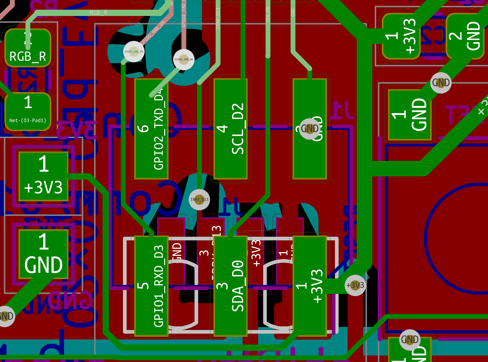

# shIRtty

A CircuitPython compatible, SAMD21 shitty addon with IR transmit/receive and RGB
LED.


## Bugs / Issues on v1.

**IMPORTANT** To make things more shitty the SAO header is upside down on the
badge. You will need a shitty inverser (included in this repo) or to put the
addon upside down. 

This is the pinout when looking at the face of the badge. Note that VCC is
bottom right (bottom left if you are looking at the connector).




 [ ] the SAO connector is upside down
 [ ] we need more capacitance on the +3V line otherwise we brown out when
 transmitting IR
 [ ] replace the very unreliable PCB usb connector by a micro usb connector
 [ ] make the reset button smaller so we can actually fit a SMD 6 pin SAO
 shrouded connector
 [ ] expose some GPIOs? 


## Micropython variant

### Build

Look at the readme in ports/atmel-samd.

```
# needed so gettext/msgfmt is available during build
export PATH="/usr/local/opt/gettext/bin:$PATH"

git clone git@github.com:adafruit/circuitpython.git
git submodule update --init --recursive
make -C mpy-cross

cd ports/atmel-samd

make BOARD=trinket_m0
(stopped there something funky going on where echo toto |xargs arm-none-eabi-gcc does not work)

```

## Bootloader

Some reference:

- https://forums.adafruit.com/viewtopic.php?f=57&t=142170&sid=a506885e77155bd9e062bbbab892efa3&start=15
- https://learn.adafruit.com/how-to-program-samd-bootloaders/itsybitsy-m0-m4-wiring

TODO:

- [x] Change the led configuration so they work on the RGB led we have on our board

### Build the bootloader

We only add two files from the adafruit version of the uf2 bootloader:

```
git clone git@github.com:adafruit/uf2-samdx1.git
```

`~/work/uf2-samdx1/boards/shirtty/board.mk`

```
CHIP_FAMILY = samd21
CHIP_VARIANT = SAMD21E18A
```

`uf2-samdx1/boards/shirtty/board_config.h`

```
#ifndef BOARD_CONFIG_H
#define BOARD_CONFIG_H

#define CRYSTALLESS 1

#define VENDOR_NAME "@sarfata"
#define PRODUCT_NAME "shIRtty"
#define VOLUME_LABEL "shIRtty"
#define INDEX_URL "https://github.com/sarfata/shirtty-addon"
#define BOARD_ID "shIRtty"

#define USB_VID 0x239A
#define USB_PID 0x001E

#define LED_PIN PIN_PA14

#endif
```

Then build with:

```
$ make BOARD=shirtty
```

I got an error at the end on a selfmain.c used for self update. #aintgottimeforthat - does not matter because the elf for the bootloader was built properly earlier.

### Using the Black Magic Probe

Connect:

- GND of the board to GND of BMP (use the SAO header)
- VCC of the board to VCC of BMP (use the SAO header)
- SWC/SWD/RST on the board to BMP (RST is optional - see below)

```
$ arm-none-eabi-gdb build/shirtty/bootloader-shirtty-v3.7.0-54-g63b4c6f.elf
(gdb) target extended-remote /dev/cu.usbmodem7AB17EC11

# If you need the black magic to provide power:
(gdb) monitor tpwr enable

(gdb) monitor swdp_scan
Target voltage: 3.3V
Available Targets:
No. Att Driver
 1      Atmel SAMD21E18A (rev D)
(gdb) attach 1

# if the bootloader is protected
(gdb) monitor unlock_bootprot

(gdb) load
(gdb) compare-sections

# if you want the new bootloader protected
(gdb) monitor lock_bootprot
```

Note: if you don't connect the RST line, you have to press reset after applying power, before running the `monitor` command. If the RST line is connected that is not needed.

### Unprotecting / Protecting the bootloader

First I had to update the firmware on my black magic probe (I had 1.6.1), I followed readme recommendations and installed daily build.

Version before:

    Black Magic Probe (Firmware 04d9749) (Hardware Version 3)

Upgrade with:

    sudo dfu-util -d 1d50:6018,:6017 -s 0x08002000:leave -D ~/Downloads/blackmagic-native.bin

Version after:

    Black Magic Probe (Firmware 04d9749) (Hardware Version 3)

Then the commands monitor unlock_bootprot becomes available.

Note: commands above do not work on the trinket m0 because the bootloader is protected. They should work on a fresh samd21e18 though.
